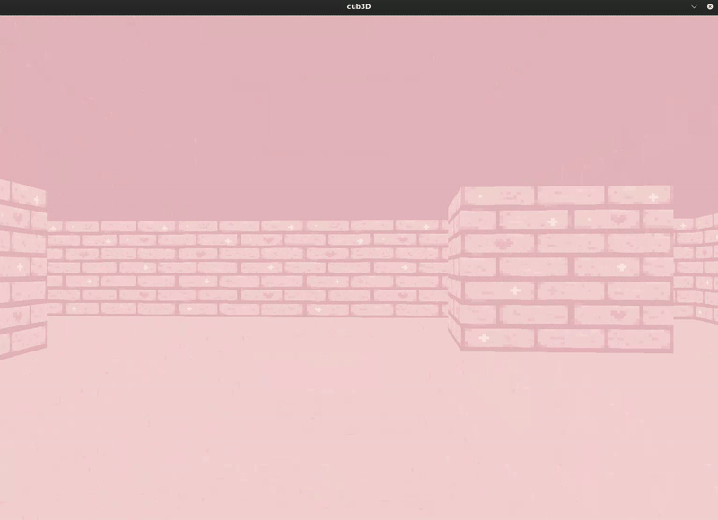

# 🧊 Cub3D

Cub3D is a project to practice **simulating 3D environments** using **raycasting**. 🎮

> 🎓 This project was developed collaboratively with misaac-c

## 🕹️ Features

- Real-time rendering with **raycasting**
- Basic movement (WASD) and camera rotation
- Wall collision handling
- Texture mapping
- Map parsing and error handling

---

## 📸 Preview




## 🚀 Getting Started

```bash
git clone git@github.com:iriscodingit/cub3d.git
cd cub3d
make
./cub3D src/maps/pastel.cub


